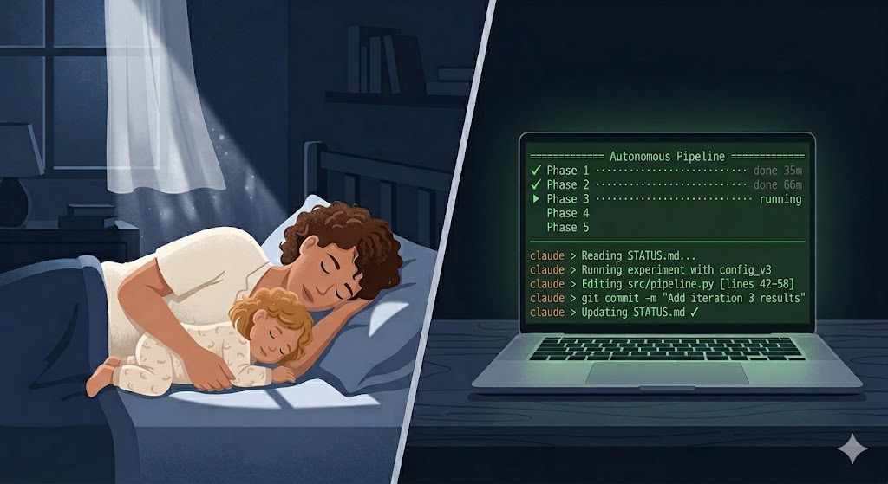

# Running Claude Code Autonomously Overnight — What Breaks and How to Fix It.

*What I learned from two overnight runs: context management, phased orchestration, and why your pipeline needs a watchdog.*

---


## The Setup

I'm building a pipeline where an agent rewrites its own instruction
manual by analyzing its conversations (more on that in an upcoming
post). Building it required a lot of code and experiments, so I
decided to let Claude Code work autonomously while I slept.

**The instruction was simple**: "Run the full evolution pipeline,
experiment with different configurations, and commit frequently."

## Attempt 1: One Long Session

I was working in my IDE with the Claude Code plugin —
using the AI chat panel the way most people do: ask a question,
get an answer, ask a follow-up. We'd been going back and forth
all afternoon, and by evening we had a clear plan and momentum.
Before heading to bed, I told it: `you have 12 hours while I'm
away. Keep experimenting — try different configurations, find
interesting findings, draft a blog post. I want you to use
the time effectively`. I left the chat session open and went
to sleep.

By that point the active session had already been running for
hours. Then it silently stopped.

Next morning I came back and asked the obvious question:

> *"Why did you stop? I was expecting you to continue working
> and experimenting for 12 hours."*

Claude's response: 
> *"You're right, I have much more to do. Let me keep pushing."*

It hadn't even realized it stopped. It just cheerfully tried
to resume — and ran out of context again almost immediately.
**The context window had filled up.**

The context window is the total text a single conversation can hold
— everything Claude has said, every tool output, every file it read.
Claude Code does have a compaction system that kicks in as context
fills up — it summarizes earlier parts of the conversation to free
space. But compaction has two problems. First, when the conversation
is so dense with tool output that even the summaries plus new work
exceed the window, compaction starts thrashing — refilling
immediately after each summary — and the session stalls out.

Second, and less obvious: **compaction dilutes instructions.** Your
CLAUDE.md rules, your earlier corrections, your established context
— all of it gets compressed into summaries. Community reports and
Anthropic's own team confirm that even essential instructions from
CLAUDE.md lose effectiveness after multiple compaction rounds. This
means a session that "works" for 30 minutes may start ignoring
rules at minute 90, not because the rules disappeared, but because
they got summarized into oblivion.

There were hours of compute time left and plenty more experiments
to run. Claude had the autonomy and the instructions. It just ran
out of *memory*, not time.

I asked Claude what I should have done differently. Its own
recommendations became the foundation for Attempt 2: break work
into sequential sessions,
suppress verbose logs, add context management rules to CLAUDE.md,
and checkpoint with STATUS.md so a new session can pick up seamlessly.

### Why the Context Filled Up

Here's what most people don't realize about Claude Code: **every
tool output goes into the context window.** When Claude runs a
script, the entire stdout and stderr of that script becomes part
of the conversation. When it reads a file, the full file content
enters the context. Every command result stays in the conversation
history.

This is fine for short sessions. But when Claude is running
experiments autonomously — executing Python scripts that call
APIs, process data, and print results — the output adds up fast:

1. **Verbose API logs.** Every HTTP request printed headers, URLs,
   and status codes. Each experiment cycle generated thousands of
   log lines — all captured as tool output, all entering the
   context.

2. **Full conversation dumps.** The experiment scripts printed
   their full output to stdout. Multiple cycles of this = massive
   tool results that Claude never needed to see in full.

3. **Large file reads.** Quality reports, blog drafts, source code —
   every file read consumed context that never gets reclaimed.

4. **No self-awareness of limits.** Claude can't monitor its own
   context usage — there's no API or function it can call to check
   how much context remains. It has no way to detect "I'm running
   low" and gracefully stop or start a new session. It just runs
   until the window fills up and the session stalls.

The scripts were doing exactly what they were supposed to do. The
problem was that their output — designed for human debugging — was
flooding the context window.

## The Fixes
Based on the lessons learned, we built a system on three layers: rules, handoff, and
orchestration.

### Layer 1: CLAUDE.md — The Project Playbook

`CLAUDE.md` is a file that Claude Code **automatically reads at
the start of every session**. You don't need to paste instructions
or remind Claude of the rules. The most common location is your
repo root, but you can also place it in `~/.claude/CLAUDE.md` for
user-wide rules, `.claude/CLAUDE.md` for project-level, or use
`.claude/rules/` for modular path-scoped rules.

We added context management rules ([example CLAUDE.md](example-CLAUDE.md)):

```markdown
## Context Management (CRITICAL for long sessions)

1. Always redirect output to files, then tail the summary:
   command_here > some_log.log 2>&1
   tail -20 some_log.log
2. Never let raw HTTP/API logs enter the conversation.
3. Don't re-read files already in context. Use grep for lookups.
4. After every major milestone, update STATUS.md with:
   - What was just completed
   - What's next
   - Key results (numbers, not raw data)

## Session Handoff
- STATUS.md at repo root is the handoff document. Read it at session start.
- Always update STATUS.md before ending a session.
```

Rule #1 alone probably 10x's the context budget. Here's the
difference:

```bash
# What Claude was doing (floods context):
python run_experiment.py
# → 2,000+ lines of HTTP logs, conversations, scores enter context

# What it should do (saves context):
python run_experiment.py > experiment.log 2>&1
tail -20 experiment.log
# → 20 lines of summary enter context. Full log on disk if needed.
```

### Layer 2: STATUS.md — The Handoff Document

When a session ends (or needs to hand off to a new one), STATUS.md
captures everything the next session needs ([example](example-STATUS.md)):

```markdown
# Project Status
**Branch**: experiment-branch
**State**: Phase 2 complete, Phase 3 next

## What's Done
- Expanded test dataset, ran baseline evaluation
- Two improvement iterations complete, results committed

## What's Next
- [ ] Phase 3: Test alternative algorithm
```

Add a rule to CLAUDE.md — `Read STATUS.md at session start.
Update it before ending.` — and the handoff is automatic. No
briefing needed.

### Layer 3: The Orchestrator — This Is What Actually Solved It

The CLAUDE.md rules help within a single session. But for 6+ hours
of autonomous work, no single session is enough. The real fix was
**breaking the work into phases, each a fresh session.**

Claude wrote an orchestrator — a shell script that launches
sessions sequentially ([sample script](run_autonomous.sh)):

```bash
for phase in $(seq "$START_PHASE" "$END_PHASE"); do
    PROMPT="$(phase_prompt "$phase" "$RUN_DIR")"

    claude \
        --print \
        --dangerously-skip-permissions \
        --model opus \
        --max-budget-usd 10.00 \
        "$PROMPT" \
        < /dev/null \
        > "$RUN_DIR/phase_${phase}.log" 2>&1

    sleep 5  # Brief pause between phases
done
```

**Critical: the `< /dev/null` line.** Without it, `claude --print`
tries to read from stdin. In a foreground terminal this is fine —
there's a TTY. But under `nohup` or in a background process,
there's no stdin, and Claude will hang for 3 seconds then exit with
a warning: *"no stdin data received, proceeding without it."* Your
phase runs for 2 seconds and produces an empty log.

Each phase gets:
- A **self-contained prompt** with specific tasks and the run
  directory path
- **Context management rules** injected into the prompt (belt
  and suspenders with CLAUDE.md)
- A **fresh context window** — no carryover from previous phases
- A **cost guardrail** (`--max-budget-usd`) per phase

The phases communicate through `STATUS.md` and the shared run
directory. Each phase reads STATUS.md, does its work, commits,
updates STATUS.md, and exits. The next phase picks up where the
last left off.

### The Watchdog

Here's the thing about overnight runs: you're not around. If
the orchestrator crashes — a network blip, an API timeout, a
transient error — nobody is there to restart it.

Claude cannot truly "watch" in the background — it only acts
when you send messages. But it did the next best thing: it suggested
a watchdog script ([sample script](watchdog.sh)). A bash loop that
checks every few minutes whether the orchestrator is still alive.
If the orchestrator dies, the watchdog:

- **Detects where work stopped** by checking which phase logs
  exist and have content
- **Restarts from the next phase**, reusing the same run directory
  so all results land together
- **Caps restarts at 3** to avoid infinite loops
- **Diagnoses repeated failures** — if the same phase crashes
  twice, the watchdog launches a short Claude session to read the failed log, diagnose the root cause,
  and fix the environment before retrying.
- **Logs everything** to `watchdog.log` — a complete audit trail

**Important: you kick off the orchestrator yourself.** Claude Code
in a chat session can't reliably launch a background process that
survives the session ending — I tried, and concluded *"I'm not
sure you are able to launch it in the new empty context, I will
do it myself."* The reliable pattern is `nohup` in a persistent
shell:

```bash
nohup run_autonomous.sh --with-watchdog > /dev/null 2>&1 &
```

The orchestrator then spawns fresh `claude --print` sessions for
each phase — completely independent of any chat. Each phase is a
new session with no memory of the chat that launched the script.
It reads STATUS.md for context instead.

## Attempt 2: The Phased Approach

I ran `nohup` in a terminal, started the watchdog, and went to
sleep.

**All 5 phases completed successfully. Zero failures. 5 hours 44
minutes.** The watchdog never needed to intervene. 

The CLAUDE.md rules and output redirection meant Claude produced
megabytes of experiment data while barely touching its context
budget. Each phase ran comfortably within its context window.

### The Meta Angle

Here's the part that still impresses me: **Claude Code built its
own reliability tooling.** The watchdog script, the orchestrator,
the `< /dev/null` fix, the Claude-as-diagnostician pattern — all
of it was written by Claude during interactive sessions where I
described the problem and it wrote the solution.

The autonomous sessions were planned and executed by Claude.
The tooling that makes them reliable was also built by Claude.
I provided direction and caught the bugs that slipped through.

For the next iterations, I focused on the domain — designing
experiments, analyzing results, deciding what to try next. Claude
picked up the pattern and started building standalone automation
wrappers for each new experiment. Each one was a single-command
bash pipeline — no phased orchestrator needed, just run it and
walk away.

## Practical Tips

**Phase sizing**: 30-60 minutes per phase. Under 10 minutes means
it's too small (combine it). Over 90 minutes means it's too large
(split it, and always commit code before running experiments — a
crash after the code but before the commit loses everything).

**Sandbox unattended sessions.** `--dangerously-skip-permissions`
is required for unattended runs — nobody is there to click
"approve." Consider running inside a dev container, using git
worktrees for isolation, or limiting tools with `--allowedTools`.
The safer alternative is `--permission-mode auto`, where a
classifier reviews each command before execution.

**Add a retrospective phase.** The orchestrator script includes
a retro phase that costs a few minutes and gives you a structured
analysis of what worked and what didn't — written by Claude from
the actual phase logs.

## What's Still Missing

### Context awareness

Claude Code doesn't expose remaining context to the model. You
can run `/context` interactively to see a breakdown, and the
status line shows `context_window.used_percentage`. But Claude
can't call a `context_remaining()` function mid-session to decide
when to wrap up. The phase-based approach works around this — each
phase gets a fresh budget — but true autonomous continuation would
need the model to detect "I'm running low" and start a new session
automatically.

### Cost tracking

`claude --print` doesn't emit cost summaries to stdout. For
budgeting autonomous runs, you have to estimate from durations
and model pricing. A `--emit-cost` flag or a cost line in the
output would help.

## What's Improving

Anthropic is actively shipping solutions to many of these problems:

- **`/goal`** sets a completion condition and Claude keeps working
  across turns until it's met. A small fast model evaluates after
  each turn whether the condition holds. Great for tasks with a
  verifiable end state ("all tests pass", "lint is clean") within
  a single session. It doesn't solve context overflow for long
  runs — you'd still hit the same wall from Attempt 1 — but for
  30-60 minute autonomous tasks it removes the need for an
  orchestrator entirely.
- **Session continuation** (`--continue` / `--resume <session_id>`)
  lets you chain sessions without STATUS.md as the only handoff
  mechanism. A phase can resume exactly where the last left off.
- **Background agents** (`claude agents`) let you dispatch and
  monitor multiple autonomous sessions from one screen, replacing
  tmux/nohup juggling.
- **`--bare` mode** skips hooks, plugins, and CLAUDE.md
  auto-discovery for faster scripted startup. Recommended for CI.

The DIY orchestrator approach described in this post still works
and gives you full control for long overnight runs. But for shorter
autonomous tasks, check `/goal` first — it may be all you need.
And keep an eye on Anthropic's latest docs — the managed tooling
is catching up fast.

## Try It Yourself

All scripts from this post are in the [companion repo](README.md)
— orchestrator, watchdog, example CLAUDE.md and STATUS.md, plus an
end-to-end test you can run in ~3 minutes. The test creates a
deliberate bug in a Python script, lets the pipeline crash, and
watches the watchdog launch a Claude diagnostic session that reads
the error log, fixes the bug, and restarts the pipeline to
completion. No configuration needed — just `nohup ./test_e2e.sh`
and `tail -f` the watchdog log.

## A Note on This Approach

This is not production-grade tooling. It's a conceptual demonstration
of the underlying problems — context limits, instruction dilution,
session lifecycle — and one way to work around them. 

Better tooling will appear. But understanding *why* these problems exist and *what*
you're actually solving gives you the background to evaluate any
tool that claims to solve autonomous agent orchestration. The
patterns — phased execution, artifact-based handoff, output
redirection, watchdog recovery — will apply regardless of the
specific implementation.

## Summary

| Problem | Attempt 1 (IDE chat) | Attempt 2 (phased CLI) |
|---------|-----------|-----------|
| Context | Stalled after 4 cycles | Zero issues |
| Output | Raw logs in context | Redirected to disk |
| Handoff | Manual restart | STATUS.md |
| Launch | Left chat session open | `nohup` in terminal |
| Recovery | None | Watchdog + Claude diagnostic |
| Results | Stalled, half done | All cycles completed |

The fundamental insight: **treat autonomous Claude Code sessions
like a CI pipeline, not like a conversation.** Break work into
phases. Each phase is a job. Jobs communicate through artifacts
(STATUS.md, files on disk), not conversation context. Launch the
orchestrator yourself with `nohup` — don't rely on a chat session
staying alive. Add a watchdog. Run it and go to sleep.

---

*I'm building an agent quality pipeline on Google Cloud using
ADK and BigQuery Agent Analytics. The full story of the
self-improving agent will be covered in the companion post. Coming soon.*
